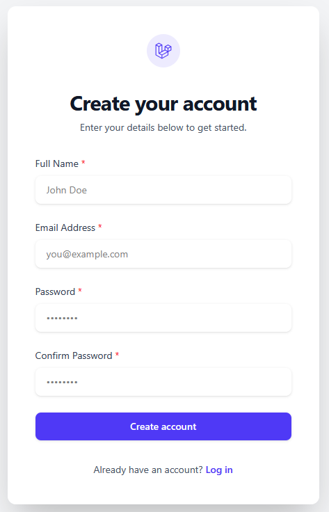

# Simple Tall Starter - A Laravel Livewire Starter Kit

This Starter kit is based on the official Livewire Starter kit. It contains my starting point when developing a new Laravel project.

## TALL stack

It uses the TALL stack, which stands for:

- [Tailwind CSS](https://tailwindcss.com/)
- [Laravel](https://laravel.com/)
- [Alpine.js](https://alpinejs.dev/)
- [Livewire](https://laravel-livewire.com/)

## Features

- ✅ Connection
- ✅ Reset password
- ✅ Registration with email confirmation

## Installation using Laravel Installer

```laravel new myproject --using=bestmomo/simple-tall-starter-kit```

Then follow the instructions in the terminal to set up your environment variables and database.

## Installation using Composer

```composer create-project bestmomo/simple-tall-starter-kit myproject```

Then follow the instructions in the terminal to set up your environment variables and database.

## License

This project is open-sourced software licensed under the [MIT license](https://opensource.org/licenses/MIT).

## Screenshots




